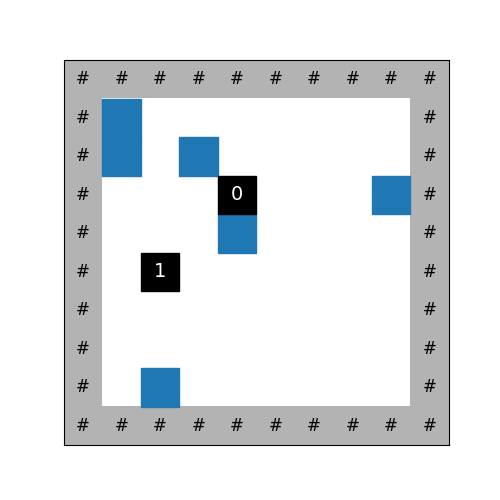
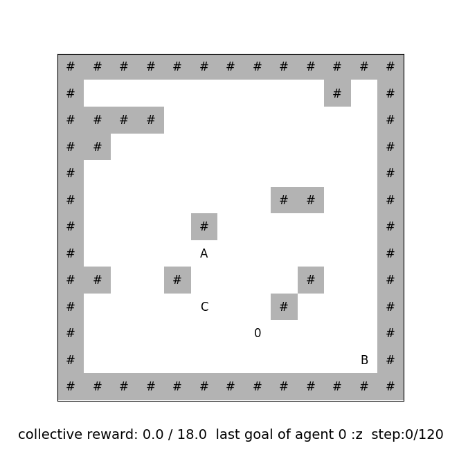
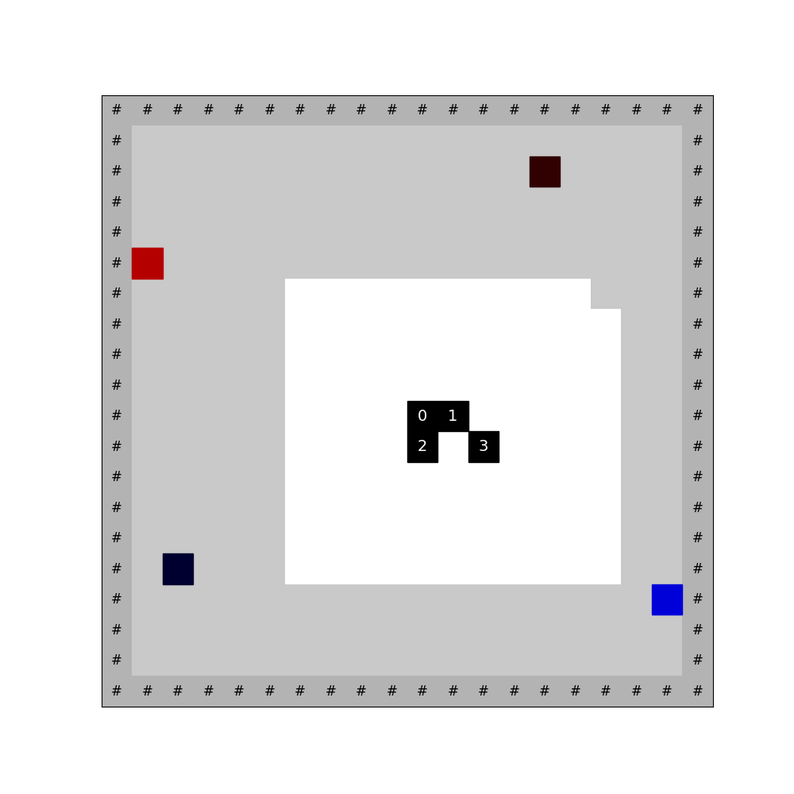

# Grid World

A collection of grid world environments.

A simple script to install the required Python packages (tested on CUDA 12 only):

```bash
# Download the code
git clone https://github.com/Social-RL/jax_pbt.git

# (Optional) Create a conda environment
# conda create -n <env_name> python=3.11
# conda activate <env_name>

# Install dependencies (tested on CUDA 12 only)
pip install -r jax_pbt/jax_pbt/env/gridworld/requirements.txt

# Install jax_pbt in editable mode
cd jax_pbt
pip install -e .
```


## Collect

The agent is rewarded by collect items in the environment.

Features:

- Items can be classified into different types, each with its unique reward and feature

- You can choose either to remove the item that is visited or keep it throughout the episode

- You can make the environment partially observable by setting the view range of agents

- [Optional] The agent observes the reward of last step

- [Optional] The agent observes the memory of history visitation

- [Optional] Hide the positions of other agents


### Example

An agent collecting all items in the grid world.




## Goal cycle

A world contains $N$ agents and $M$ goal positions. Each agent is optimized to move cyclically through the goal positions in the correct order. Visiting the next goal out of order results in a penalty with a negative reward.


### Example

An example GIF with one agent and the goal order $A \to B \to C \to A \to \cdots$ is shown below.




## Reset grid

A game with multiple trials. There are several goals on the map with positive or negative rewards. The reward is revealed only after the agent reaches the goal. In the initial trial, all agents explore the map and receive rewards at the end of the phase. Agents are colored according to their prestige cue (average historical reward). After the first trial, agents should infer from others to maximize their rewards.


### Example

An example GIF with two trials (the first with a reward scale of $1$ and the second with a reward scale of $10$) is shown below. Red indicates a positive reward, and blue indicates a negative reward.

